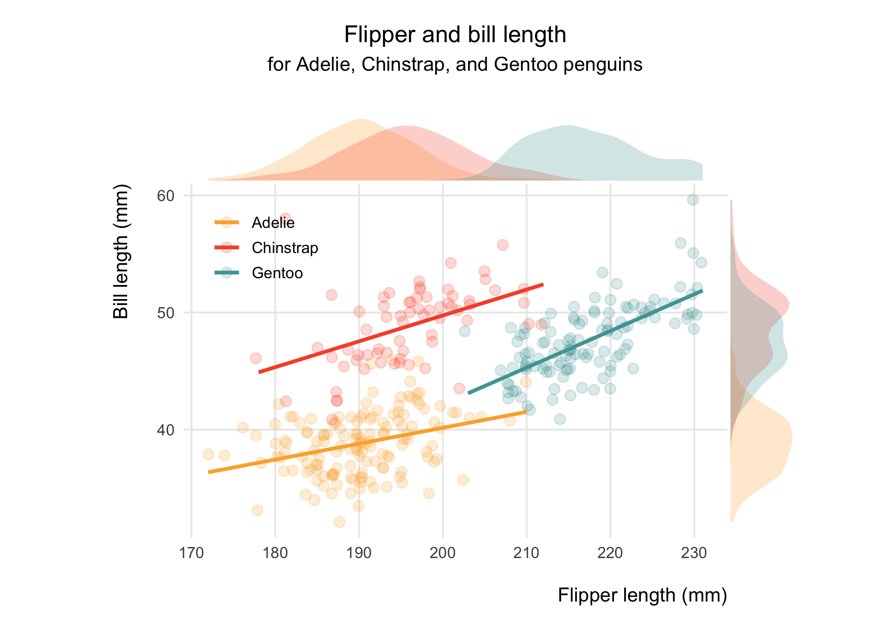
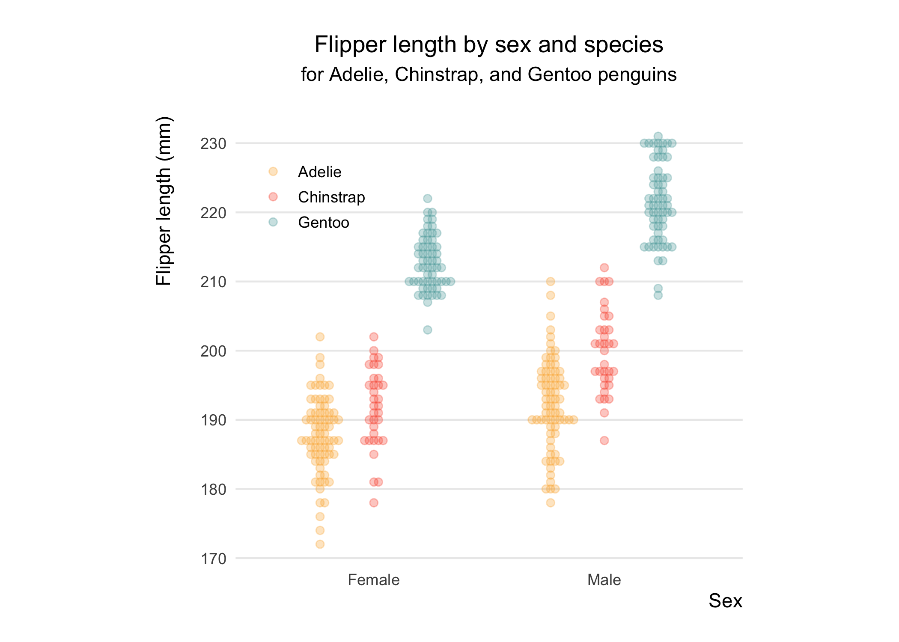

Palmer Penguins
================


<div style="text-align: right">

Artwork by [Allison Horst](https://www.allisonhorst.com)

</div>

## Preface

The `palmerpenguins` package is aimed at providing an alternative to the
well-known `iris` dataset, which is commonly used for an introduction to
data exploration and visualisation. A more detailed documentation of the
package, developed by Horst and colleagues, can be found
[here](https://allisonhorst.github.io/palmerpenguins/).

I wanted to familiarise myself with the dataset as well for future
teaching on data analysis and visualisation with R. Much more
importantly, these penguins are so adorable\! 🐧

``` r
# Setup
library(palmerpenguins) # Data source
library(ggbeeswarm)     # Beeswarm plots
library(tidyverse)      # Data wrangling, visualisation
library(ggExtra)        # Marginal plots
```

## Data

The authors provide two datasets. I am using the simplified version of
the raw data, `penguins`.

``` r
# Dataset
penguins <- penguins %>%               # Read in the data
  na.omit() %>%                        # Complete-case analysis
  mutate(species = as_factor(species), # Modify variables
         island = as_factor(island),
         sex = as_factor(sex),
         year = as_factor(year),
         sex = fct_recode(sex, "Male" = "male", "Female" = "female"))
```


<div style="text-align: right">

Artwork by [Allison Horst](https://www.allisonhorst.com)

</div>

``` r
# Inspect the data
glimpse(penguins)
```

    Rows: 333
    Columns: 8
    $ species           <fct> Adelie, Adelie, Adelie, Adelie, Adelie, Adelie, Ade…
    $ island            <fct> Torgersen, Torgersen, Torgersen, Torgersen, Torgers…
    $ bill_length_mm    <dbl> 39.1, 39.5, 40.3, 36.7, 39.3, 38.9, 39.2, 41.1, 38.…
    $ bill_depth_mm     <dbl> 18.7, 17.4, 18.0, 19.3, 20.6, 17.8, 19.6, 17.6, 21.…
    $ flipper_length_mm <int> 181, 186, 195, 193, 190, 181, 195, 182, 191, 198, 1…
    $ body_mass_g       <int> 3750, 3800, 3250, 3450, 3650, 3625, 4675, 3200, 380…
    $ sex               <fct> Male, Female, Female, Female, Male, Female, Male, F…
    $ year              <fct> 2007, 2007, 2007, 2007, 2007, 2007, 2007, 2007, 200…

## Visualisation

Firstly, I am going to reproduce the first plot illustrated on the
`palmerpenguins` site, with slight modification. This is basically a
scatter plot overlaid by ordinary-least-squares regression lines across
species. Penguins with longer flippers tended to have a longer bill,
irrespective of the species.

``` r
# Set plots to some formatting

## Colours and theme of my choosing
colours_penguins <- c("Gentoo" = "#50A3A4",
                      "Chinstrap" = "#F95335",
                      "Adelie" = "#FCAF38")
theme_set(theme_minimal())

## Further refinement
theme_update(
  plot.title = element_text(hjust = 0.5),    # Centre-align title
  plot.subtitle = element_text(hjust = 0.5), # Centre-align subtitle
  legend.title = element_blank(),            # Remove legend title
  legend.position = c(0.15, 0.82),           # Move legend to bottom right
  legend.background = element_blank(),       # Remove legend background
  legend.box.background = element_blank(),   # Remove lengend-box background
  legend.spacing.y = unit(0.01, 'mm'),       # Make legend closer
  legend.key.height = unit(0.5, "cm"),       # Make legend closer
  panel.grid.minor = element_blank(),        # Remove minor lines
  axis.title.x = element_text(hjust = 1),    # Move title for x-axis
  axis.title.y = element_text(hjust = 1)     # Move title for y-axis
)
```

``` r
# Scatter plot
scatter_plot <- penguins %>% 
  ggplot(aes(x = flipper_length_mm, y = bill_length_mm)) +
    geom_jitter(aes(colour = species),
                alpha = 0.20, size = 2.5) +
    geom_smooth(aes(colour = species),
                method = "lm", formula = y ~ x, se = FALSE) +
    scale_colour_manual(values = colours_penguins) +
    coord_fixed(ratio = 1.4) +
    labs(x = "\nFlipper length (mm)\n",
         y = "Bill length (mm)\n",
         title = "\nFlipper and bill length",
         subtitle = "for Adelie, Chinstrap, and Gentoo penguins\n")

# Add density plots corresponding to each axis
ggMarginal(scatter_plot, type = "density", margins = "both",
           size = 8, groupFill = TRUE, colour = "transparent", alpha = 0.25)
```



The second plot depicts the distributions of flipper length by sex and
species using a beeswarm plot. Relatively few data points in each
category due to stratification allow to make use of this pretty-looking
plot, which also shows individual observations. On average, male
penguins had longer flippers than females did. Also, Gentoo penguins had
the longest flippers than the other two species.

``` r
# Beeswarm plot
penguins %>% 
  ggplot(aes(x = sex, y = flipper_length_mm)) +
    geom_beeswarm(aes(colour = species),
                  size = 1.8, dodge.width = 0.7, alpha = 0.3) +
    scale_colour_manual(values = colours_penguins) +
    coord_fixed(ratio = 0.03) +
    theme(panel.grid.major.x = element_blank()) +
    labs(x = "Sex\n",
         y = "Flipper length (mm)\n",
         title = "\nFlipper length by sex and species",
         subtitle = "for Adelie, Chinstrap, and Gentoo penguins\n")
```



## Appendix

``` r
sessionInfo()
```

``` 
R version 4.0.1 (2020-06-06)
Platform: x86_64-apple-darwin17.0 (64-bit)
Running under: macOS Catalina 10.15.5

Matrix products: default
BLAS:   /Library/Frameworks/R.framework/Versions/4.0/Resources/lib/libRblas.dylib
LAPACK: /Library/Frameworks/R.framework/Versions/4.0/Resources/lib/libRlapack.dylib

locale:
[1] en_GB.UTF-8/en_GB.UTF-8/en_GB.UTF-8/C/en_GB.UTF-8/en_GB.UTF-8

attached base packages:
[1] stats     graphics  grDevices utils     datasets  methods   base     

other attached packages:
 [1] ggExtra_0.9          forcats_0.5.0        stringr_1.4.0       
 [4] dplyr_1.0.0          purrr_0.3.4          readr_1.3.1         
 [7] tidyr_1.1.0          tibble_3.0.3         tidyverse_1.3.0     
[10] ggbeeswarm_0.6.0     ggplot2_3.3.2        palmerpenguins_0.1.0

loaded via a namespace (and not attached):
 [1] Rcpp_1.0.5       lubridate_1.7.9  lattice_0.20-41  utf8_1.1.4      
 [5] assertthat_0.2.1 digest_0.6.25    mime_0.9         R6_2.4.1        
 [9] cellranger_1.1.0 backports_1.1.8  reprex_0.3.0     evaluate_0.14   
[13] httr_1.4.1       pillar_1.4.6     rlang_0.4.7      readxl_1.3.1    
[17] rstudioapi_0.11  miniUI_0.1.1.1   blob_1.2.1       Matrix_1.2-18   
[21] rmarkdown_2.3    labeling_0.3     splines_4.0.1    munsell_0.5.0   
[25] shiny_1.5.0      broom_0.5.6      compiler_4.0.1   vipor_0.4.5     
[29] httpuv_1.5.4     modelr_0.1.8     xfun_0.15        pkgconfig_2.0.3 
[33] mgcv_1.8-31      htmltools_0.5.0  tidyselect_1.1.0 fansi_0.4.1     
[37] crayon_1.3.4     dbplyr_1.4.4     withr_2.2.0      later_1.1.0.1   
[41] grid_4.0.1       xtable_1.8-4     nlme_3.1-148     jsonlite_1.6.1  
[45] gtable_0.3.0     lifecycle_0.2.0  DBI_1.1.0        magrittr_1.5    
[49] scales_1.1.1     cli_2.0.2        stringi_1.4.6    farver_2.0.3    
[53] fs_1.4.1         promises_1.1.1   xml2_1.3.2       ellipsis_0.3.1  
[57] generics_0.0.2   vctrs_0.3.1      tools_4.0.1      glue_1.4.1      
[61] beeswarm_0.2.3   hms_0.5.3        fastmap_1.0.1    yaml_2.2.1      
[65] colorspace_1.4-1 rvest_0.3.5      knitr_1.28       haven_2.3.1     
```
